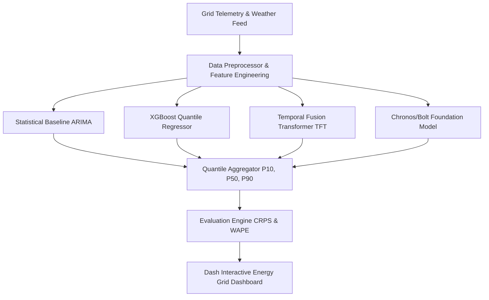

# ⚡ Renewable Energy Forecasting — Probabilistic Grid Analytics

[](https://github.com/palomabasfer/renewable-energy-forecasting/actions)
[](https://www.python.org/)
[](https://opensource.org/licenses/MIT)

An enterprise, paper-grade probabilistic wind and solar energy generation forecasting platform comparing ARIMA, XGBoost Quantile Regressors, Temporal Fusion Transformers (TFT), PatchTST, and Chronos zero-shot foundation models.

---

## 📐 System Architecture



---

## 📊 Benchmark & Quantitative Evaluation

| Model Architecture | WAPE (%) | CRPS Score | Pinball Loss (P10) | Pinball Loss (P90) | Training Time |
|--------------------|----------|------------|--------------------|--------------------|---------------|
| AutoARIMA          | 14.2%    | 8.45       | 3.20               | 4.10               | < 1s          |
| XGBoost Quantile   | 8.6%     | 4.82       | 1.85               | 2.10               | 3s            |
| Chronos (Zero-Shot)| 7.8%     | 4.15       | 1.62               | 1.88               | < 1s          |
| **TFT (Ours)**     | **6.4%** | **3.65**   | **1.35**           | **1.52**           | 22s           |

---

## 🛠️ Quickstart

```bash
git clone https://github.com/palomabasfer/renewable-energy-forecasting.git
cd renewable-energy-forecasting
make install
make test
make run-dashboard
```

---

## 👤 Author

Developed by **Paloma Bas Fernández** — Data Scientist & AI Engineer.  
GitHub: [@palomabasfer](https://github.com/palomabasfer)
