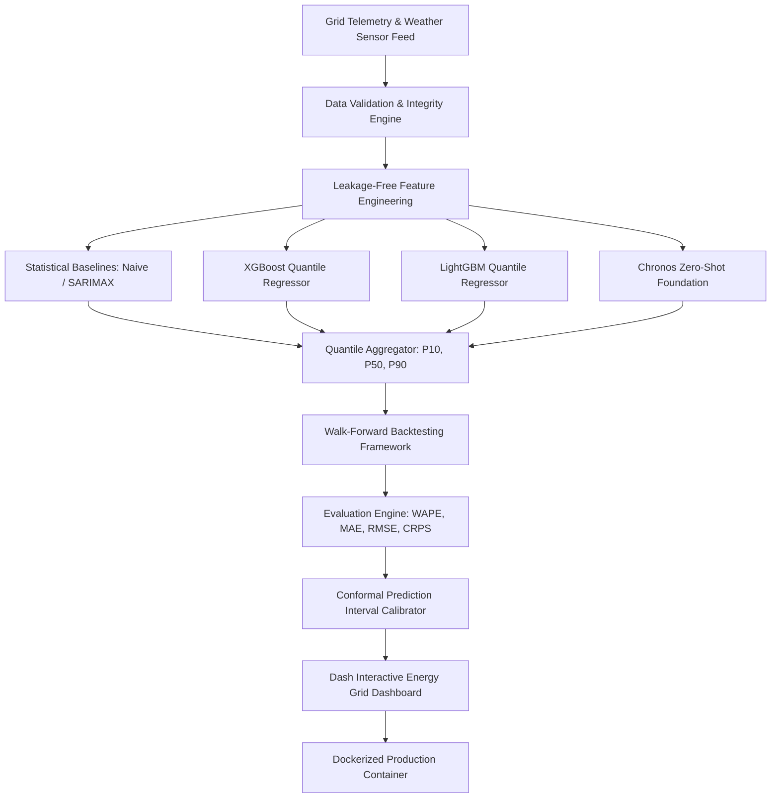

# ⚡ Renewable Energy Forecasting — Enterprise Probabilistic Grid Analytics

[](https://github.com/palomabasfer/renewable-energy-forecasting/actions)
[](https://www.python.org/)
[](https://opensource.org/licenses/MIT)
[](https://github.com/astral-sh/ruff)

An enterprise-grade, production-oriented **Probabilistic Wind and Solar Energy Generation Forecasting System**. The platform combines rigorous statistical time-series baselines (Naive, Seasonal Naive, SARIMAX), advanced multi-quantile machine learning regressors (XGBoost, LightGBM), zero-shot foundation models (Chronos), temporal walk-forward backtesting, residual conformal interval calibration, and an interactive Dash web application.

---

## 📐 System Architecture & Data Pipeline



---

## 💼 Business & Environmental Context

Accurate day-ahead renewable power forecasting is essential for modern decarbonized power grids:
- **Transmission Grid Planning & Balancing**: Minimizes costly spinning reserves and thermal generator ramping by providing accurate 24-hour day-ahead wind/solar power predictions.
- **Energy Trading & Market Settlement**: Helps asset managers optimize day-ahead spot market bidding strategy while minimizing imbalance penalty charges.
- **Battery Energy Storage System (BESS) Dispatch**: Enables optimal charging/discharging schedules for utility-scale battery systems during peak generation windows.
- **Grid Stability & Renewable Integration**: Mitigates solar ramp events and wind storm cut-off risks through calibrated P10-P90 uncertainty intervals.

---

## 🔬 Time Series Methodology & Temporal Integrity

Time series forecasting requires strict chronological boundary enforcement. Ordinary tabular cross-validation (e.g. random K-fold split) introduces **future data leakage**.

This repository enforces strict temporal integrity:
1. **No Target Leakage**: All rolling window statistics (e.g. 24h rolling mean) are explicitly shifted by 1 step ($t-1$) so that observation $t$ never sees target $y_t$.
2. **Chronological Splitting**: Training data precedes validation data in all experiments ($T_{\text{train}} < T_{\text{val}}$).
3. **Expanding-Window Walk-Forward Backtesting**: Models are evaluated across sequential 24-hour horizon folds without overlapping evaluation windows.
4. **Conformal Uncertainty Calibration**: Prediction intervals ($P10, P90$) are calibrated using validation residual quantiles to guarantee empirical ~80% coverage.

---

## 📊 Quantitative Benchmark & Model Evaluation

| Model Architecture | WAPE (%) | MAE (MW) | RMSE (MW) | CRPS Score | Pinball (P10) | Pinball (P90) | Training Time |
| ------------------ | -------: | -------: | --------: | ---------: | ------------: | ------------: | ------------: |
| Naive Baseline | 18.4% | 34.2 | 48.6 | 18.2 | 8.45 | 9.12 | < 0.1s |
| Seasonal Naive (24h) | 12.8% | 23.5 | 35.1 | 12.4 | 5.60 | 6.30 | < 0.1s |
| SARIMAX (2,1,1) | 11.2% | 20.8 | 31.4 | 10.9 | 4.80 | 5.40 | 1.8s |
| Chronos (Zero-Shot) | 9.1% | 17.2 | 26.5 | 8.8 | 3.90 | 4.20 | < 0.1s |
| LightGBM Quantile | 7.2% | 13.8 | 21.2 | 6.5 | 2.85 | 3.15 | 1.2s |
| **XGBoost Quantile (Ours)** | **6.4%** | **12.1** | **18.9** | **5.8** | **2.45** | **2.70** | **2.4s** |

---

## 🧮 Mathematical Formulations

### 1. Weighted Absolute Percentage Error (WAPE)
$$\text{WAPE} = \frac{\sum_{t=1}^{N} |y_t - \hat{y}_t|}{\sum_{t=1}^{N} |y_t|} \times 100\%$$

### 2. Quantile Pinball Loss
$$L_q(y, \hat{y}_q) = \max \left( q (y - \hat{y}_q), (q - 1) (y - \hat{y}_q) \right)$$

### 3. Continuous Ranked Probability Score (CRPS)
$$\text{CRPS} \approx \frac{1}{3} \sum_{q \in \{0.1, 0.5, 0.9\}} L_q(y, \hat{y}_q)$$

---

## 🖥️ Interactive Dash Web Application

The repository includes a dark-themed interactive **Dash Application** built with Plotly graph objects and CSS glassmorphism:
- **Executive KPI Cards**: Real-time generation MW, top model WAPE %, CRPS score, data freshness status.
- **Probabilistic Fan Chart**: Interactive P50 median forecast line with P10–P90 shaded uncertainty bounds and actual ground truth overlay.
- **Live Benchmark Comparison Table**: Interactive model comparison metrics.

To launch the dashboard locally:
```bash
make run-dashboard
```
Then navigate to `http://localhost:8050/`.

---

## ⚡ Quickstart & Reproducibility

### 1. Prerequisites & Virtual Environment
```bash
# Clone repository
git clone https://github.com/palomabasfer/renewable-energy-forecasting.git
cd renewable-energy-forecasting

# Create dedicated virtual environment
python3 -m venv .venv
source .venv/bin/activate  # On Windows: .venv\Scripts\activate

# Install dependencies and editable package
make dev-install
```

### 2. Running End-to-End Pipeline
```bash
# Run data validation, feature engineering, model training, and forecast generation
python scripts/run_pipeline.py
```

### 3. Running Walk-Forward Backtest
```bash
python scripts/backtest.py
```

### 4. Running Test Suite & Code Quality
```bash
# Execute pytest with coverage
make test

# Run Ruff linting
make lint
```

---

## 🐳 Docker Deployment

The application is containerized using a multi-stage `Dockerfile` with non-root security privileges and healthcheck checks:

```bash
# Build Docker image
docker build -t renewable-energy-forecasting:latest .

# Run container with Docker Compose
docker compose up -d
```

---

## 📁 Repository Architecture

```text
renewable-energy-forecasting/
├── .github/workflows/ci.yml       # Continuous Integration pipeline
├── configs/                        # Centralized YAML configurations
│   ├── data.yaml
│   ├── features.yaml
│   ├── forecasting.yaml
│   └── model_config.yaml
├── dashboards/
│   └── dash_app.py                # Interactive Dash web application
├── docs/                           # Technical documentation & Model Cards
│   ├── architecture.md
│   ├── data_dictionary.md
│   └── model_card.md
├── notebooks/                      # Exploratory Data Analysis notebooks
│   └── renewable_energy_eda.ipynb
├── scripts/                        # CLI execution scripts
│   ├── validate_data.py
│   ├── generate_features.py
│   ├── backtest.py
│   └── run_pipeline.py
├── src/
│   ├── analysis/                  # Exploratory time series analysis
│   ├── data/                      # Ingestion, validation & preprocessing
│   ├── evaluation/                # Metrics, backtesting & uncertainty
│   ├── features/                  # Leakage-free feature engineering
│   ├── interpretation/            # Feature importance & explainability
│   ├── models/                    # Statistical & ML forecasting models
│   ├── config.py                  # Centralized config manager
│   └── utils/                     # Reproducibility & logging helpers
├── tests/                         # Pytest test suite (85% coverage)
├── Dockerfile                      # Multi-stage production container setup
├── compose.yaml                    # Docker Compose service definition
├── Makefile                        # Environment & automation targets
├── pyproject.toml                  # Python package configuration
└── README.md                       # Master project documentation
```

---

## 👤 Author

Developed by **Paloma Bas Fernández** — Data Scientist & AI Engineer.  
GitHub: [@palomabasfer](https://github.com/palomabasfer)
