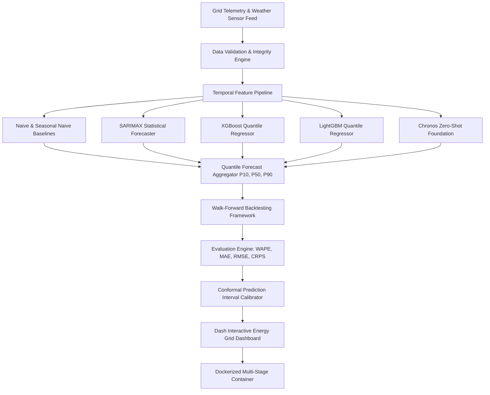

# 🏛️ System Architecture & Data Flow

## Layer Architecture Breakdown

1. **Ingestion & Validation Layer (`src/data/`)**: Validates timestamp monotonicity, checks for missing grid hours, filters negative generation values, and enforces strict physical bounds.
2. **Feature Engineering Layer (`src/features/`)**: Constructs 1-step shifted rolling window statistics, multi-period lags, calendar encodings, and cyclical sine/cosine transformations without target leakage.
3. **Model Framework Layer (`src/models/`)**: Houses modular probabilistic forecasters emitting point forecasts (P50) and uncertainty prediction bounds (P10, P90).
4. **Validation & Evaluation Layer (`src/evaluation/`)**: Implements walk-forward temporal cross-validation, CRPS score calculations, pinball loss evaluation, and conformal interval calibration.
5. **Presentation Layer (`dashboards/`)**: Interactive Dash web application delivering real-time visualization and benchmark tables.
